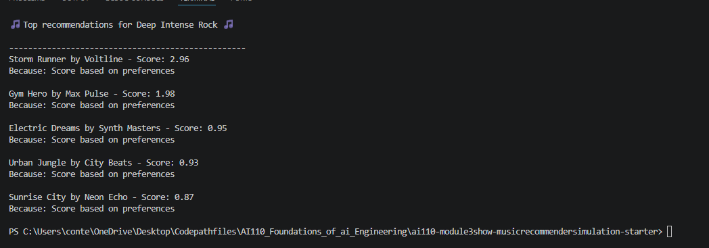
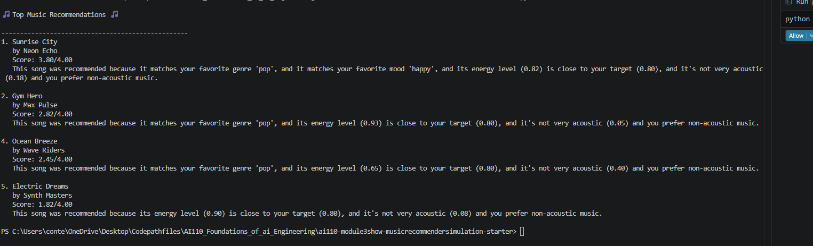

# 🎵 Music Recommender Simulation

## Project Summary

In this project you will build and explain a small music recommender system.

Your goal is to:

- Represent songs and a user "taste profile" as data
- Design a scoring rule that turns that data into recommendations
- Evaluate what your system gets right and wrong
- Reflect on how this mirrors real world AI recommenders

Replace this paragraph with your own summary of what your version does.

---

## How The System Works

Explain your design in plain language.

## 🧩 Real-world recommendations Answer

Real-world recommender systems combine massive behavior logs (what millions of users played, skipped, liked), content and context metadata, and machine learning models to generate candidate items, score how well each candidate matches a user’s profile/session, then rank with business constraints (diversity, freshness, novelty). Your version will prioritize the same core: reliable item-level scoring (distance to user "vibe" preference using energy/valence/danceability/acousticness), simple ranking by score, and a basic filter for repeats. My focus first will be on correctness and explainability before adding complexity like exploration or session-aware dynamics.

Some prompts to answer:

- What features does each `Song` use in your system
  - For example: genre, mood, energy, tempo

 Song
id (int)
title (string)
artist (string)
genre (string)
mood (string)
numeric audio features (floats 0..1):
energy
valence
danceability
acousticness
tempo_bpm (normalized to tempo_scaled for vector math)


- What information does your `UserProfile` store
UserProfile
user_id (int/string)
preferred_genres (list or distribution)
preferred_moods (list or distribution)
target_features (float vector):
energy_pref
valence_pref
danceability_pref
acousticness_pref
tempo_pref (0..1 normalized)
optional behavior history (for sim):
liked_songs (list of song IDs)
recent_session (sequence of last N song IDs)
feature_history stats (mean energy, mean valence, etc.)

- How does your `Recommender` compute a score for each song
1. How the Recommender computes a score for each song
Song feature vector (normalized):

energy, valence, danceability, acousticness in [0,1]
tempo_scaled in [0,1]
optional 1-hot genre/mood
UserProfile target vector:

energy_pref, valence_pref, danceability_pref, acousticness_pref, tempo_pref
Per-feature distance-to-preference (example with triangular kernel):

score_f = max(0, 1 - abs(song_f - pref_f) / delta)
delta controls tolerance (e.g., 0.3)
Weighted combined score:

song_score = w_e*score_energy + w_v*score_valence + ... + w_t*score_tempo
weights sum to 1 (e.g., 0.25 each for basic model)
Final (optional) category boost:

+0.1 if genre matches user preferred genre
+0.1 if mood matches preferred mood
cap at 1.0
So each song gets a scalar relevance score in [0,1].

## Recommender output image



- How do you choose which songs to recommend
Generate candidate songs (the full catalog or filtered subset)
Compute song_score for each
Sort descending by song_score
Apply simple business filters:
exclude previously played songs
optionally require min genre/mood diversity
Return top-K (e.g., top 5 or top 10)
You can include a simple diagram or bullet list if helpful.

---

## Getting Started

### Setup

1. Create a virtual environment (optional but recommended):

   ```bash
   python -m venv .venv
   source .venv/bin/activate      # Mac or Linux
   .venv\Scripts\activate         # Windows

2. Install dependencies

```bash
pip install -r requirements.txt
```

3. Run the app:

```bash
python -m src.main
```

### Running Tests

Run the starter tests with:

```bash
pytest
```

You can add more tests in `tests/test_recommender.py`.

---

## Experiments You Tried

Use this section to document the experiments you ran. For example:

- What happened when you changed the weight on genre from 2.0 to 0.5
- What happened when you added tempo or valence to the score
- How did your system behave for different types of users

---

## Limitations and Risks

Summarize some limitations of your recommender.

Examples:

- It only works on a tiny catalog
- It does not understand lyrics or language
- It might over favor one genre or mood

You will go deeper on this in your model card.

---

## Reflection

Read and complete `model_card.md`:

[**Model Card**](model_card.md)

Write 1 to 2 paragraphs here about what you learned:

- about how recommenders turn data into predictions
- about where bias or unfairness could show up in systems like this


---

## 7. `model_card_template.md`

Combines reflection and model card framing from the Module 3 guidance. :contentReference[oaicite:2]{index=2}  

```markdown
# 🎧 Model Card - Music Recommender Simulation

## 1. Model Name

Give your recommender a name, for example:

> VibeFinder 1.0

---

## 2. Intended Use

- What is this system trying to do
- Who is it for

Example:

> This model suggests 3 to 5 songs from a small catalog based on a user's preferred genre, mood, and energy level. It is for classroom exploration only, not for real users.

---

## 3. How It Works (Short Explanation)

Describe your scoring logic in plain language.

- What features of each song does it consider
- What information about the user does it use
- How does it turn those into a number

Try to avoid code in this section, treat it like an explanation to a non programmer.

---

## 4. Data

Describe your dataset.

- How many songs are in `data/songs.csv`
- Did you add or remove any songs
- What kinds of genres or moods are represented
- Whose taste does this data mostly reflect

---

## 5. Strengths

Where does your recommender work well

You can think about:
- Situations where the top results "felt right"
- Particular user profiles it served well
- Simplicity or transparency benefits

---

## 6. Limitations and Bias

Where does your recommender struggle

Some prompts:
- Does it ignore some genres or moods
- Does it treat all users as if they have the same taste shape
- Is it biased toward high energy or one genre by default
- How could this be unfair if used in a real product

---

## 7. Evaluation

How did you check your system

Examples:
- You tried multiple user profiles and wrote down whether the results matched your expectations
- You compared your simulation to what a real app like Spotify or YouTube tends to recommend
- You wrote tests for your scoring logic

You do not need a numeric metric, but if you used one, explain what it measures.

---

## 8. Future Work

If you had more time, how would you improve this recommender

Examples:

- Add support for multiple users and "group vibe" recommendations
- Balance diversity of songs instead of always picking the closest match
- Use more features, like tempo ranges or lyric themes

---

## 9. Personal Reflection

A few sentences about what you learned:

- What surprised you about how your system behaved
- How did building this change how you think about real music recommenders
- Where do you think human judgment still matters, even if the model seems "smart"

